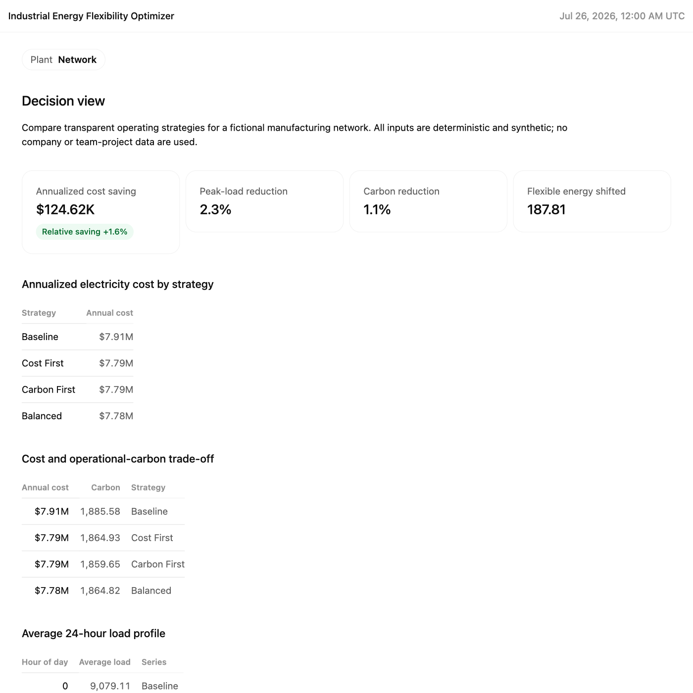

# Industrial Energy Flexibility Optimizer

A reproducible decision-support project for balancing electricity cost, grid
carbon intensity and peak demand across a fictional German manufacturing
network.

> **Independent portfolio project.** Every plant, meter reading, price signal
> and operating constraint in this repository is deterministic synthetic data.
> No employer, customer, university-team or hackathon data or code are used.



## Decision questions

- How much industrial load can move without changing daily production energy?
- Which operating strategy best balances cost, carbon and peak demand?
- Which plant contributes the largest flexibility opportunity?
- At which intervals should energy-intensive processes be increased or deferred?
- Which assumptions would need operational validation before deployment?

## Headline result

For the included 21-day synthetic dataset, the **Balanced** strategy:

- reduces modeled annualized electricity cost by **€124.6k (1.58%)**,
- reduces peak load by **2.28%**,
- reduces operational electricity emissions by **1.10%**, and
- shifts **187.8 MWh** while conserving daily energy at every plant.

These are model outputs for a fictional network, not forecasts or claimed
company savings.

## Dashboard

Open [`dashboard/index.html`](dashboard/index.html) directly, or serve the
repository locally:

```bash
python -m http.server 8000
```

Then visit `http://localhost:8000/dashboard/`.

The dashboard contains:

- plant and operating-strategy filters,
- decision KPI cards,
- annual cost comparison,
- cost-versus-carbon trade-off view,
- baseline-versus-optimized daily load profile, and
- a sortable list of the largest flexibility actions.

It is self-contained and makes no network requests.

## How the model works

1. `src/generate_data.py` creates three fictional sites at 15-minute grain.
2. Each site's electrical load is separated into fixed and flexible portions.
3. `src/optimize.py` redistributes only the flexible portion within each
   plant-day.
4. Three transparent strategies weight price, carbon intensity and peak load
   differently.
5. Daily energy is conserved, interval bounds are enforced and negative load is
   impossible.
6. Scenario metrics feed a portable, source-documented dashboard.

No machine learning is used. The objective is explainability, auditability and
clear operational guardrails.

## Repository structure

```text
data/
  plant_loads_synthetic.csv   deterministic model input
  interval_scenarios.csv      interval-level scenario output
  scenario_summary.csv        network KPI output
  plant_summary.csv           plant KPI output
dashboard/
  artifact.json               canonical dashboard manifest and snapshot
  index.html                  self-contained interactive dashboard
docs/
  data-contract.md            fields, grain and validation rules
  methodology.md              assumptions, formulas and limitations
  validation-report.md        independent calculation and sharing review
src/
  generate_data.py            synthetic data generator
  optimize.py                 bounded load-shifting model
  build_artifact.py           dashboard data and provenance builder
tests/
  test_model.py               conservation, bounds and outcome tests
```

## Run from scratch

```bash
python -m venv .venv
source .venv/bin/activate
pip install -r requirements.txt

python src/generate_data.py
python src/optimize.py
python src/build_artifact.py
python -m unittest discover -s tests -v
```

## Metric definitions

- **Annualized cost:** 21-day interval energy cost scaled to 365 days, plus
  twelve monthly demand charges at €10/kW.
- **Cost saving:** baseline annualized cost minus scenario annualized cost.
- **Carbon reduction:** one minus scenario emissions divided by baseline
  emissions for the same 21-day window.
- **Peak reduction:** one minus scenario maximum load divided by baseline
  maximum load.
- **Flexible energy shifted:** half the absolute interval movement, preventing
  energy moved out and back in from being counted twice.

## Deployment boundary

Before production use, an operator would need approved process windows,
machine-level ramp constraints, live tariff contracts, site peak-charge rules,
forecast uncertainty, control-system integration and safety sign-off. The
repository deliberately stops at transparent decision support.

## License

MIT License. See [`LICENSE`](LICENSE).
